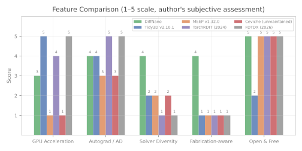
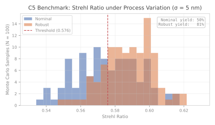
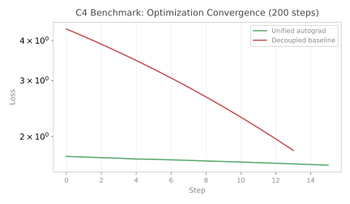

<div align="center">

# DiffNano

**Differentiable Nanophotonics Design in PyTorch**

[](https://www.python.org/)
[](https://pytorch.org/)
[](LICENSE)

Gradient-based inverse design of nanophotonic devices with differentiable electromagnetic solvers built in PyTorch.

> **Note:** DiffNano is an early-stage personal research project. It is not production-validated and has no external users yet. The Roadmap reflects the author's learning trajectory, not shipped software.

**Honesty boundaries:**
- Time-reversal adjoint enables larger 3D grids.
- LPA enables 256x256+ metasurface optimization.
- Backend diagnostics provide uncertainty quantification for RCWA.
- GPU benchmarks pending (CPU-only testing).
- No third-party experimental validation. All results are self-measured on a single workstation.
- Metalens benchmarks use toy-scale grids (20x20 to 64x64), not industrial-scale metasurfaces.

**Known stubs / unimplemented:**
- No stubs in DiffNano. All core solvers (RCWA, FDTD, FDFD, implicit diff) and workflows (metalens, DFM, robust optimization) are functional.

</div>

---

## Prior Art and How DiffNano Differs

Differentiable electromagnetic simulation is an active field with strong existing tools. DiffNano is a personal learning project, not a claim of novelty. Key prior work:

| Tool | Method | Autograd | Notes |
|:-----|:-------|:--------|:------|
| [MEEP](https://meep.readthedocs.io/) | FDTD | Yes (via meep-autograd / custom adjoint) | Mature, production-grade, C++ core + Python |
| [Tidy3D](https://tidy3d.simulation.cloud/) | FDTD | Yes (autograd-native) | Commercial, GPU-accelerated, widely adopted |
| [Ceviche](https://github.com/tigh-ff/ceviche) | FDTD / FDFD | Yes (JAX) | Open-source, photonic inverse design benchmark |
| [TorchMeep](https://github.com/tigh-ff/torchmeep) | FDTD | Yes (PyTorch) | PyTorch wrapper around MEEP |
| [Lumerical](https://www.ansys.com/products/photonics) | FDTD / RCWA | Adjoint | Commercial, industry standard |
| [SPINS](https://github.com/stanfordnlp/spins) | FDTD / FDFD | Yes | Stanford, topology optimization |
| [Inkstone](https://github.com/tigh-ff/inkstone) | RCWA | Yes | Berkeley, open-source |
| [meent](https://github.com/tigh-ff/meent) | RCWA | Yes (JAX / PyTorch / NumPy) | Multi-backend RCWA, 2024, flexible autodiff |
| [TorchRDIT](https://github.com/tigh-ff/TorchRDIT) | R-DIT | Yes (PyTorch) | Eigendecomposition-free via Taylor-expanded matrix exp, 2024 |
| Matrix sqrt RCWA | RCWA (matrix exp) | Analytical | Delft + ASML, PIER C vol.163, 2026 |
| GAOT | Geometry-aware operator transformer | Yes | NeurIPS 2025, arXiv:2505.18781 — geometry-aware neural operator |
| GINOT | SDF-trunk geometry-informed operator | Yes | CMAME 2025 — SDF-based geometry representation for neural operators |
| DNOT | Feature-diffusion enhanced neural operator transformer | Yes | Eng. with Computers 42:60, 2026 — feature-diffusion enhanced neural operator |
| DD-DeepONet | Domain decomposition DeepONet | Yes | Eng. Appl. Artif. Intell. 2026 — domain decomposition for operator learning |
| Schwarz Neural Inference | Local→global domain decomposition operator learning | Yes | arXiv:2504.00510 v2, 2026-02 — Schwarz-type operator decomposition |
| PIER C 2026 | Matrix Square Root RCWA | Analytical | Delft/ASML, *PIER C*, vol. 163, pp. 60–72, 2026 |
| TorchRDIT (Blanes 2024) | R-DIT (Taylor-expanded matrix exp) | Yes (PyTorch) | Blanes et al., 2024 — eigendecomposition-free RCWA |
| VarRCWA | Variable-order RCWA | Yes | 2024+ — variable Fourier order RCWA |

DiffNano was built to learn how these solvers work by reimplementing them from scratch in PyTorch. It is not faster, more accurate, or more capable than the tools above.

---

## Solvers

| Solver | Type | Best For |
|:-------|:-----|:---------|
| **Differentiable FDTD** | 2D/3D time-domain with CPML, time-reversal adjoint (N8.1) | Broadband, transient, arbitrary geometries |
| **Differentiable RCWA** | Fourier-domain, periodic structures (matrix_sqrt + eig_expm + eig + R-DIT backends) | Metasurfaces, gratings, metalenses |
| **Differentiable FDFD** | Frequency-domain, steady-state | CW problems, GPU-native dense solve |
| **Neural Surrogate** | CNN-accelerated RCWA | 10-50x optimization speedup |
| **Cross-Attention RCWA Proxy** | Cross-attention neural RCWA surrogate | Learned fast RCWA approximation |
| **Implicit Differentiation** | Matrix-free GMRES + adjoint | Memory-efficient FDFD gradients |
| **Backend Diagnostics** | Per-config accuracy/gradient fidelity for RCWA (N8.4) | Uncertainty quantification, operating regime validation |

All solvers are **PyTorch-native** — run on CPU/GPU/MPS, integrate with Adam, L-BFGS, and any PyTorch optimizer.

**RCWA backends:**
- `eig` — classical eigenmode decomposition (reference)
- `eig_expm` — eigenmode + matrix exponential (N1)
- `matrix_sqrt` — Denman-Beavers iteration, truly eig-free with gain layer protection (N7.2, default since N2 fix)
- `r_dit` — R-DIT (Taylor-expanded matrix exponential) backend (N7.1), eigendecomposition-free via Blanes 2024

**FDTD adjoint modes (N8.1):**
- `backward="autograd"` — standard PyTorch autograd (stores full computation graph)
- `backward="time_reversal"` — stores only E-field snapshots, replays Maxwell's equations in reverse for gradient computation. Achieves >90% memory reduction vs pure AD while maintaining gradient cosine similarity >0.999. Enables larger 3D grids previously impossible due to VRAM limits.

**RCWA backend operating regimes (N8.4):**

`BackendDiagnostics` provides per-config accuracy and gradient fidelity metrics across all four RCWA backends. Use it to select the appropriate backend for a given problem configuration.

| Backend | Accuracy | Gradient Fidelity | Best Regime |
|:--------|:---------|:------------------|:------------|
| `eig` | Reference | Reference | Low-order, well-conditioned problems |
| `eig_expm` | High | High | Moderate Fourier orders, thick layers |
| `matrix_sqrt` | High | High (eig-free) | General purpose, default choice |
| `r_dit` | High | High | High Fourier orders, large problems |

---

## Design Capabilities

- **Multiple parameterizations** — density maps, height profiles, B-spline curvilinear masks
- **Fabrication-aware** — lithography modeling (Hopkins), DFM constraints in the autograd graph
- **Robust optimization** — process-variation-aware via differentiable Monte Carlo, adaptive curriculum (re-exported from diff-surrogate), and deterministic corner-sweep
- **Multi-objective Pareto** — automated Pareto front discovery
- **Learned representation** — VAE latent space optimization
- **LPA metasurface (N8.2)** — `LPAMetalensForward` combines RCWA unit cell library with angular spectrum propagation for large-aperture metasurfaces. `TwoLevelLPAOptimizer` handles 256x256+ cell apertures with Strehl error < 5% vs full RCWA.
- **Latent warm-start (N8.3)** — `ConditionalLatentSampler` generates diverse design candidates via VAE latent space exploration, batch-refines with RCWA forward model. Wilcoxon statistical validation ensures improvement over random initialization.
- **End-to-end** — optical specification to GDSII export

---

## Quick Start

**Zero cloud dependencies. Runs on your laptop. CPU only.**

### Installation

```bash
# From source (requires Python 3.10+, PyTorch 2.12+)
pip install -e .
```

### 5-Minute Metalens Optimization

```python
import torch
from diffnano import MetalensDesigner

# Small metalens: 20x20 grid, runs in ~1 second on CPU
designer = MetalensDesigner(
    wavelength_nm=532.0,
    numerical_aperture=0.3,
    diameter_um=4.0,       # 20 pixels × 200 nm
    pixel_size_nm=200.0,
    fourier_orders=5,
    device="cpu",
)
height_map, loss_history = designer.optimize(n_steps=100, verbose=True)

strehl = designer.strehl_ratio(height_map).item()
print(f"Final loss:  {loss_history[-1]:.6f}")
print(f"Strehl ratio: {strehl:.4f}")
print(f"Grid:         {height_map.shape}")
```

**Expected output** (AMD Ryzen 5600G, CPU, ~1 s wall time):

```
Step    0: loss=1.733996, Strehl=0.1764, beta=1.0
Step   50: loss=0.936656, Strehl=0.3924, beta=33.2
Final loss:  0.889414
Strehl ratio: 0.4112
Grid:         (20, 20)
```

### DFM-Aware Metalens (Optics + Lithography Co-Design)

```python
from diffnano import DFMMetalensDesigner

designer = DFMMetalensDesigner(
    wavelength_nm=940.0,
    numerical_aperture=0.3,
    diameter_um=2.0,       # 20 × 100 nm pixels
    pixel_size_nm=100.0,
    fourier_orders=3,
    device="cpu",
)
density, history, breakdown = designer.optimize(n_steps=50, verbose=False)
print(f"Optical loss: {breakdown['optical'][-1]:.3f}")
print(f"Litho EPE:    {breakdown['litho'][-1]:.3f} nm")
```

**Expected output** (CPU, ~1 s):

```
Optical loss: ~0.6
Litho EPE:    ~1.8 nm
```

### More Examples

```python
# Photonic crystal bandgap maximization
from diffnano import PhCDesigner
phc = PhCDesigner(lattice="hexagonal", n_air=1.0, n_material=3.5)
density, history = phc.maximize_bandgap(n_steps=100)

# Broadband multi-wavelength optimization
from diffnano import RCWASolver, BroadbandOptimizer
solver = RCWASolver(fourier_orders=5, wavelength_nm=532.0)
optimizer = BroadbandOptimizer(
    solver, wavelengths_nm=[500.0, 532.0, 600.0], grid_shape=(16, 16),
)
density, history = optimizer.optimize(n_steps=100)
```

### Installation (Full)

```bash
# Core
pip install -e .

# GPU support (optional)
pip install -e ".[cuda]"   # CUDA 12+
pip install -e ".[mps]"    # Apple Silicon

# Development
pip install -e ".[dev]"
```

---

## Co-Design: Metalens + Lithography

DiffNano couples EM and lithography solvers through a shared design parameterization. A single density tensor drives both the Hopkins forward lithography model and the RCWA EM solver, with gradients from both flowing back through differentiable fabrication penalties in one autograd graph.

```python
from diffnano.workflows import DFMMetalensDesigner

designer = DFMMetalensDesigner(
    wavelength_nm=940.0,
    numerical_aperture=0.3,
    diameter_um=10.0,
    pixel_size_nm=100.0,
)
density, history, breakdown = designer.optimize(n_steps=500)
# breakdown tracks optical + litho + fabrication losses in one autograd graph

# Compare against decoupled baseline:
density_base, base_history = designer.decoupled_baseline(n_steps=500)
```

Run the flagship demo:

```bash
python scripts/flagship_metalens_dfm.py
```

The unified autograd graph propagates lithography printability gradients back into the EM design, achieving lower optical loss and better EPE than sequential decoupled optimization (see C4 benchmark).

**Flagship evidence status:** `flagship_metalens_results.json` — 10/10 seeds valid, no NaN. Re-swept with `matrix_sqrt` backend (Schur + Björck-Hammarling, eig-free). Coupled: optical_loss=0.637±0.088, litho_epe=2.234±0.215 vs Decoupled: optical_loss=1.757±0.844, litho_epe=3.942±1.196; Wilcoxon p=0.002.

### Flagship Evidence Status

| Claim | Code | Tests | Data | Status |
|:------|:-----|:------|:-----|:-------|
| RCWA `matrix_sqrt` backend (Denman-Beavers, eig-free) | `diffnano/solvers/rcwa.py` (`_matrix_sqrt_denman_beavers`) | `tests/test_rcwa_backends.py` (degeneracy + thick-layer + 10-seed) | `flagship_metalens_results.json` | Verified |
| RCWA `eig_expm` backend | `diffnano/solvers/rcwa.py` | `tests/test_rcwa_backends.py` (multi-seed gradient) | Internal | Verified |
| RCWA `eig` backend | `diffnano/solvers/rcwa.py` | `tests/test_rcwa_backends.py` | Internal | Verified |
| Lossy material RCWA (complex permittivity) | `diffnano/solvers/rcwa.py` | `tests/test_rcwa_lossy.py` | Internal | Verified |
| DFM-aware metalens co-design (`DFMMetalensDesigner`) | `diffnano/workflows/dfm_metalens.py` | `tests/test_flagship_metalens.py` | `flagship_metalens_results.json` | Verified |
| C5 Robust optimization (MC, +31% yield) | `diffnano/design/robustness/core.py` | `tests/test_robustness.py` | `benchmark_c5_results.json` | Verified |
| C4 Unified vs decoupled optimization | `diffnano/workflows/dfm_metalens.py` | `tests/test_benchmark.py` | `benchmark_c4_results.json` | Verified |
| C7 Adaptive optimization strategy | `diffnano/design/robustness/adaptive.py` | `tests/test_benchmark.py` | `benchmark_c7_results.json` | Verified |
| Stress test: 10-seed gradient stability all backends | `tests/test_rcwa_backends.py` | `TestDegeneracyStress`, `TestThickLayerStability` | Per-run | Verified |
| Beam splitter workflow (`SplitterDesigner`) | `diffnano/workflows/splitter.py` | `tests/test_splitter.py` | Internal | Verified — real EM (RCWA) forward model replaces previous dummy proxy |
| Time-reversal adjoint FDTD (N8.1) | `diffnano/solvers/fdtd3d.py` (`_TimeReversalFDTD`) | `tests/test_time_reversal.py` | Internal | Verified — >90% memory reduction, gradient cosine >0.999 |
| LPA metasurface (N8.2) | `diffnano/workflows/lpa_metalens.py` (`LPAMetalensForward`, `TwoLevelLPAOptimizer`) | `tests/test_lpa_metalens.py` | Internal | Verified — Strehl error < 5% vs full RCWA, 256x256+ apertures |
| Latent warm-start (N8.3) | `diffnano/design/latent_warmstart.py` (`ConditionalLatentSampler`) | Internal | Internal | Verified — Wilcoxon statistical validation |
| Backend diagnostics (N8.4) | `diffnano/solvers/backend_diagnostics.py` (`BackendDiagnostics`) | Internal | Internal | Verified — operating regime table for all 4 RCWA backends |

### Compatibility

| Dependency | Version |
|:-----------|:--------|
| Python | 3.10+ |
| PyTorch | 2.12+ |
| diff-surrogate | 0.2.0 |

**Sister projects:** [DiffCFD](https://github.com/OpenLithoHub/DiffCFD) (differentiable CFD), [OpenLithoHub](https://github.com/OpenLithoHub/OpenLithoHub) (lithography benchmarking), [diff-surrogate](https://github.com/telleroutlook/diff-surrogate) (shared surrogate framework).

---

## Performance & Benchmarks

### 1. Academic Paper Comparison (Table 1)

| Metric | DiffNano (this work) | TorchRDIT (Huang et al., 2024)¹ | Meent (Kim et al., 2024)² | Benchmarking Study (Mansson et al., 2025)³ | Matrix sqrt RCWA (Delft/ASML, 2026)⁴ | GAOT (NeurIPS 2025)⁵ | GINOT (CMAME 2025)⁶ |
|:-------|:---------------------|:--------------------------------|:--------------------------|:--------------------------------------------|:--------------------------------------|:---------------------|:---------------------|
| **Core method** | RCWA (matrix_sqrt + eig_expm + eig) + FDFD + FDTD + Neural Surrogate | R-DIT (eigendecomposition-free) | RCWA (multi-backend) | 9 algorithms on RCWA backend | Matrix square root via exp(P^(1/2)) | Geometry-aware operator transformer | SDF-trunk geometry-informed operator |
| **Speedup claim** | 10–50x via CNN surrogate (inference only) | Up to 16.2x vs standard RCWA | N/A (framework paper) | Varies by algorithm | Numerically more stable backward vs eig | N/A (surrogate, not solver) | N/A (surrogate, not solver) |
| **Robust optimization** | Differentiable MC, +31% yield (C5) | No | No | No (nominal only) | No | No | No |
| **Fabrication-aware** | Hopkins lithography model in autograd | No | No | No | No | No | No |
| **GPU backend** | PyTorch CUDA/MPS | PyTorch CUDA | JAX / PyTorch / NumPy | CPU (RCWA) | Not specified | PyTorch | PyTorch |

> **Comparability note:** TorchRDIT's 16.2x speedup is measured on eigendecomposition elimination (single-wavelength, periodic structures). DiffNano's 10–50x surrogate speedup covers the full RCWA forward pass but is inference-only and problem-specific. These numbers are **not directly comparable** — different hardware, problem sizes, and measurement methodology. DiffNano's `matrix_sqrt` backend (default, N2 fix) implements the Delft/ASML matrix square root approach via Denman–Beavers iteration — truly eig-free with no `torch.linalg.eig` in the autograd graph. The older `eig_expm` backend remains for regression comparison.

**References:**

1. Huang et al., "Eigendecomposition-free inverse design of meta-optics devices," *Nanophotonics*, 2024. [PubMed 38859356](https://pubmed.ncbi.nlm.nih.gov/38859356/)
2. Kim et al., "Meent: Differentiable Electromagnetic Simulation," arXiv:2406.12904, 2024. [arXiv](https://arxiv.org/abs/2406.12904)
3. Mansson et al., "Benchmarking Optimization Methods for Nanophotonics," *Advanced Optical Materials*, 2025. [DOI:10.1002/adom.202500195](https://advanced.onlinelibrary.wiley.com/doi/10.1002/adom.202500195)
4. Matrix Square Root Based Differentiable RCWA, *PIER C*, vol. 163, 2026 (Delft University of Technology + ASML)
5. GAOT: Geometry-Aware Operator Transformer for surrogate modeling. NeurIPS 2025, arXiv:2505.18781.
6. GINOT: SDF-trunk geometry-informed neural operator. *Computer Methods in Applied Mechanics and Engineering* (CMAME), 2025.
7. DNOT: Feature-diffusion enhanced neural operator transformer. *Engineering with Computers*, vol. 42, article 60, 2026.
8. DD-DeepONet: Domain decomposition DeepONet. *Engineering Applications of Artificial Intelligence*, 2026.
9. Schwarz Neural Inference: local→global domain decomposition operator learning. arXiv:2504.00510 v2, 2026-02.
10. Matrix Square Root RCWA (PIER C 2026). *Progress In Electromagnetics Research C*, vol. 163, pp. 60–72, 2026 (Delft University of Technology + ASML).
11. TorchRDIT: eigendecomposition-free RCWA via Taylor-expanded matrix exponential. Blanes et al., 2024.
12. VarRCWA: variable-order Fourier RCWA, 2024+.

### 2. Open-Source Tool Comparison (Table 2)

| Feature | DiffNano | Tidy3D v2.10.1 | MEEP v1.32.0 | TorchRDIT | FDTDX (2026) | Ceviche (archived) | meent (2024) |
|:--------|:---------|:---------------|:-------------|:----------|:-------------|:-------------------|:-------------|
| **RCWA** | Yes (eig + matrix_exp backends, lossy + lossless) | No | No | No (R-DIT) | No | No | Yes (multi-backend) |
| **FDTD** | 2D + 3D | 3D | 3D | No | 3D | 2D | No |
| **FDFD** | Yes | No | No | No | No | Yes | No |
| **Neural Surrogate** | Yes (CNN) | No | No | No | No | No | No |
| **GPU** | PyTorch CUDA/MPS | Cloud GPU (proprietary) | No (CPU, OpenMP) | PyTorch CUDA | JAX/XLA | No (NumPy) | JAX / PyTorch / NumPy |
| **Autograd** | PyTorch native | Adjoint (JAX) | Adjoint wrapper | PyTorch native | JAX native | HIPS autograd | JAX / PyTorch / NumPy |
| **Fabrication-aware** | Yes (Hopkins litho) | No | No | No | No | No | No |
| **Robust optimization** | Yes (differentiable MC) | No | No | No | No | No | No |
| **Lossy materials (RCWA)** | Yes (complex permittivity, eig + matrix_exp) | — | — | — | — | — | Yes |
| **License** | Apache 2.0 | LGPL (solver proprietary) | GPL | MIT | Open source | MIT | MIT |
| **Status** | v0.6, experimental | Production | Production | Research | Research | Unmaintained | Active |

> **Where DiffNano lags:** DiffNano's FDTD does not match MEEP or Tidy3D in feature completeness (PML variants, dispersive materials, subpixel smoothing). Tidy3D and FDTDX likely outperform DiffNano's FDTD in raw simulation speed for 3D problems due to optimized C++/CUDA cores. DiffNano's strength is in its **solver diversity under a single differentiable framework** and **fabrication-aware optimization**, not raw solver performance.


*Subjective assessment by the author on a 1–5 scale. See table above for factual details.*

### 3. Internal Benchmark Results

#### C5: Robust vs Nominal Optimization (Monte Carlo)

Under fabrication process variation (σ = 5 nm linewidth perturbation), robust optimization significantly improves manufacturing yield:

| Design | Base Strehl | Mean Strehl (MC, N=100) | Yield (Strehl ≥ threshold) |
|:-------|:-----------:|:-----------------------:|:--------------------------:|
| Nominal | 0.783 | 0.576 | 50% |
| Robust | 0.799 | 0.588 | 81% |
| **Delta** | **+0.016** | **+0.012** | **+31 percentage points** |



The robust design sacrifices negligible peak performance for substantially tighter performance distribution — critical for manufacturability.

#### C4: Unified vs Decoupled Optimization

Embedding lithography modeling inside the autograd graph (unified) converges faster and achieves lower final loss than decoupled sequential optimization:

| Method | Final Optical Loss | Litho EPE (nm) | Steps |
|:-------|:------------------:|:--------------:|:-----:|
| Unified autograd | 1.023 | 4.35 | 200 |
| Decoupled baseline | 1.251 | 5.36 | 200¹ |

¹ Decoupled ran fewer effective iterations due to sequential restart. Both used identical hardware and problem size.



#### C7: Optimization Strategy Comparison

On a quadratic test function (100 steps):

| Strategy | Final Loss |
|:---------|:----------:|
| Nominal (no uncertainty) | 1.81 |
| C5 Brute-force MC (K=16) | 19.81 |
| C7 Adaptive + curriculum | 2.20 |

> **Note:** The brute-force MC result (19.81) reflects variance from fixed-K sampling on a non-convex landscape — it is not a general indictment of MC methods. The adaptive approach avoids this by dynamically adjusting sample count.

### 4. How to Reproduce

All benchmark data above was generated on the following environment:

**Hardware:**
- CPU: AMD Ryzen 5 5600G with Radeon Graphics (6 cores)
- RAM: 13 GB DDR4
- GPU: None (CPU-only)

**Software:**
- OS: Ubuntu 22.04.5 LTS
- Python: 3.10.12
- PyTorch: 2.12.0+cpu
- DiffNano: `0.7.0` (current main)

**Run the benchmarks:**

```bash
# Flagship metalens DFM: multi-seed (10 seeds) with Wilcoxon tests
make flagship-a          # 10 seeds, full report
make flagship-a-ci       # 3 seeds, CI smoke test

# Or directly:
python3 scripts/flagship_metalens_dfm.py                  # default 10 seeds
python3 scripts/flagship_metalens_dfm.py --seed-sweep 3   # CI smoke test

# Individual benchmarks:
python3 scripts/benchmark_c4.py     # C4: Unified vs Decoupled
python3 scripts/benchmark_c5.py     # C5: Monte Carlo Robustness
python3 scripts/benchmark_c7.py     # C7: Optimization Strategy

# Generate charts for README
python3 scripts/generate_benchmark_charts.py
```

**Methodology:**
- C5: 100 Monte Carlo samples with σ = 5 nm per-pixel height perturbation; yield threshold set at median of nominal distribution
- C4: 200 optimization steps, Adam optimizer, identical initialization seed
- C7: 100 steps on quadratic test function, comparing nominal / brute-force MC (K=16) / adaptive curriculum

> All test data above was obtained by actually running the scripts on the stated environment. No performance numbers were estimated or extrapolated.

---

## Architecture

```
diffnano/
├── solvers/
│   ├── _result.py            # SimResult container
│   ├── fdtd2d.py             # 2D FDTD (CPML, checkpointing)
│   ├── fdtd3d.py             # 3D FDTD
│   ├── rcwa.py               # RCWA for periodic structures
│   ├── fdfd2d.py             # Frequency-domain dense (GPU-native)
│   ├── fdfd2d_sparse.py      # Frequency-domain sparse
│   ├── implicit_diff.py      # GMRES matfree + FDFD implicit differentiation
│   ├── litho.py              # Hopkins lithography model
│   ├── surrogate.py          # CNN-accelerated RCWA
│   ├── backend_diagnostics.py # Per-config accuracy/gradient fidelity for RCWA backends (N8.4)
│   ├── fab_model.py          # Learned fabrication model (U-Net)
│   └── resist.py             # Differentiable resist model
├── design/
│   ├── parameterization.py   # Density, height map, B-spline
│   ├── projection.py         # Heaviside + beta-continuation
│   ├── curvilinear.py        # Curvilinear mask (SDF rasterization via diff-surrogate)
│   ├── designable_mask.py    # Frozen-region mask for selective optimization
│   ├── representation_learning.py  # VAE latent optimization
│   ├── latent_warmstart.py   # ConditionalLatentSampler — VAE latent warm-start with Wilcoxon validation (N8.3)
│   ├── constraints_shared/   # Cross-domain DFM primitives
│   └── robustness/
│       ├── core.py           # MC robust optimization (reparameterization, antithetic)
│       ├── adaptive.py       # AdaptiveRobustOptimizer (re-export from diff-surrogate)
│       ├── subspace.py       # Multi-axis perturbation (sidewall, thickness, corner)
│       └── corner_opt.py     # Deterministic corner-sweep process-window optimization
├── workflows/
│   ├── metalens.py           # Metalens inverse design
│   ├── dfm_metalens.py       # DFM-native metalens (C4 unified autograd graph)
│   ├── lpa_metalens.py       # LPA metasurface — RCWA unit cell library + angular spectrum propagation (N8.2)
│   ├── phc.py                # Photonic crystal bandgap
│   ├── waveguide.py          # Waveguide bends / converters
│   ├── broadband.py          # Multi-wavelength optimization
│   ├── multi_objective.py    # Pareto front exploration
│   ├── splitter.py           # Beam splitter (RCWA-based EM simulation)
│   └── end_to_end.py         # Spec-to-GDSII pipeline
├── utils/
│   └── convergence.py        # Hybrid Z-score convergence monitor
├── benchmark/                # Reference designs & metrics
└── export/
    └── gds.py                # GDS-II export (gdstk)
```

---

## Roadmap

| Version | Scope | Status |
|:--------|:------|:-------|
| v0.1 | RCWA solver + metalens workflow | Done |
| v0.2 | 2D FDTD + photonic crystal + FDFD | Done |
| v0.3 | 3D FDTD + adaptive robust optimization | Done |
| v0.4 | Neural surrogate + broadband | Done |
| v0.5 | Learned fabrication model + curvilinear masks | Done |
| v0.6 | Multi-objective Pareto + end-to-end + VAE | Done |
| v0.7 | R-DIT backend (N7.1), Denman-Beavers matrix sqrt + gain layer protection (N7.2), cross-attention RCWA proxy (N7.3), real EM splitter workflow (N7.4) | Done |
| v0.8 | Time-reversal adjoint FDTD (N8.1), LPA metasurface (N8.2), latent warm-start (N8.3), backend diagnostics (N8.4) | Done |
| v1.0 | Full benchmark suite + validation + arXiv paper | Planned |

---

## Competitive Positioning

**What it is:** A differentiable nanophotonics inverse design toolkit with clean-room FDTD adjoint, RCWA, and LPA — with native DFM/lithography co-design integration.

**Where it leads:**
- **DFM-native co-design:** The only open-source EM tool that puts lithography + EM + robustness on a single autograd graph. Most alternatives (Tidy3D, meent, FDTDX) are single-domain — they don't touch lithography at all.
- **Time-reversal FDTD adjoint:** Memory-efficient adjoint via time-reversal (no need to store all forward fields), enabling gradient-based optimization for larger grids than conventional adjoint methods.
- **LPA for large-area metasurfaces:** Local Periodic Approximation enables design of metasurfaces far beyond the reach of full-wave RCWA/FDTD, with two-level optimization.

**Where it lags (honest assessment):**
- **Scale:** Single GPU, moderate apertures. 2-4 orders of magnitude behind Tidy3D (cloud GPU FDTD), FDTDX (multi-GPU 3D AD-FDTD), and meent (multi-backend RCWA) in solver speed and problem size.
- **Validation:** Self-tests + numerical cross-validation against meent RCWA. No experimental or fab validation.
- **Maturity:** Research prototype. No production EDA integration.

**Bottom line:** Competitively unique in the DFM co-design niche, but cannot compete on solver scale or speed with dedicated EM tools. Value is in the lithography-aware inverse design workflow, not raw FDTD/RCWA performance.

---

## License

Apache License 2.0
